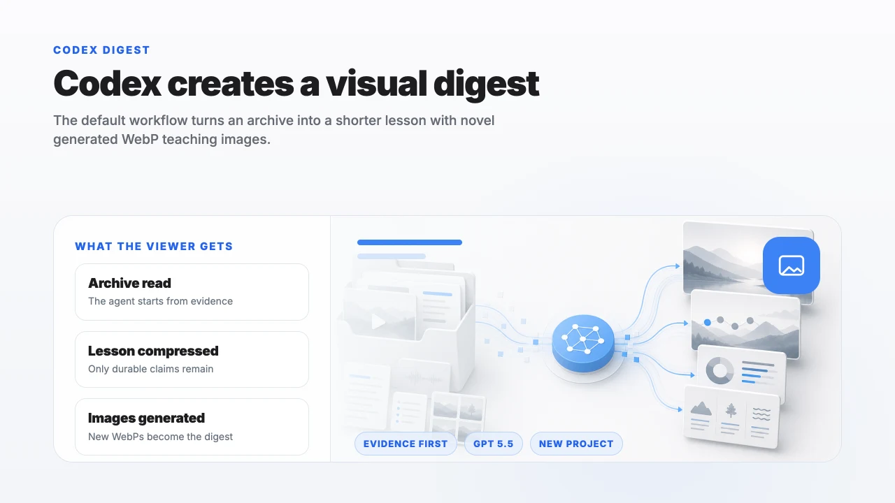
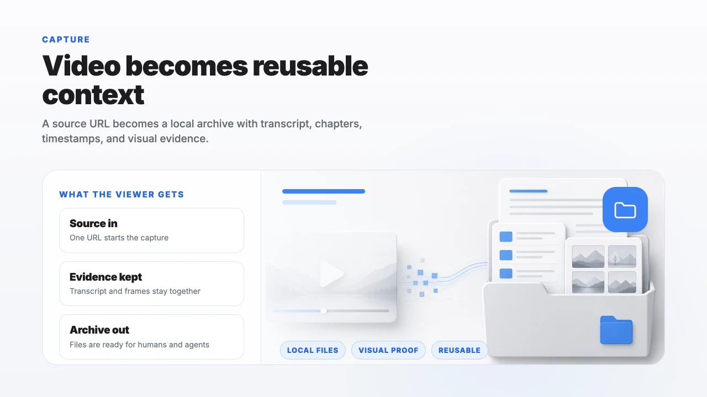
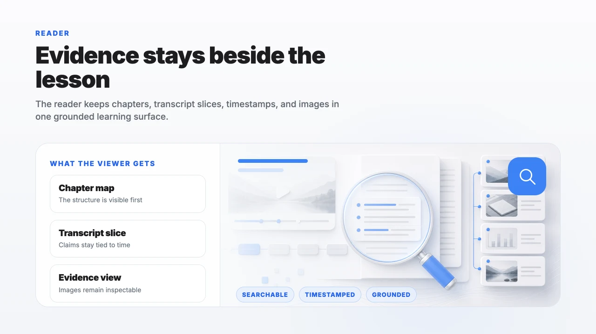
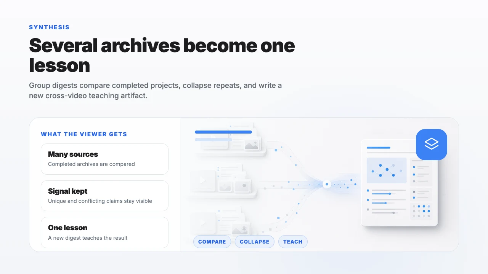
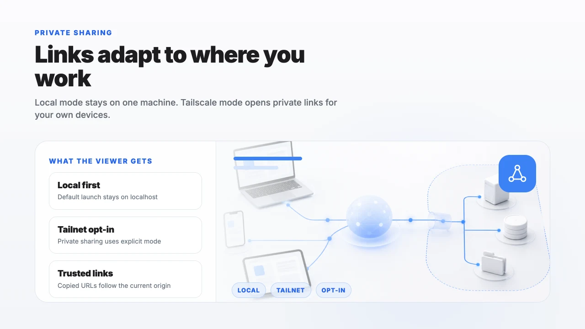
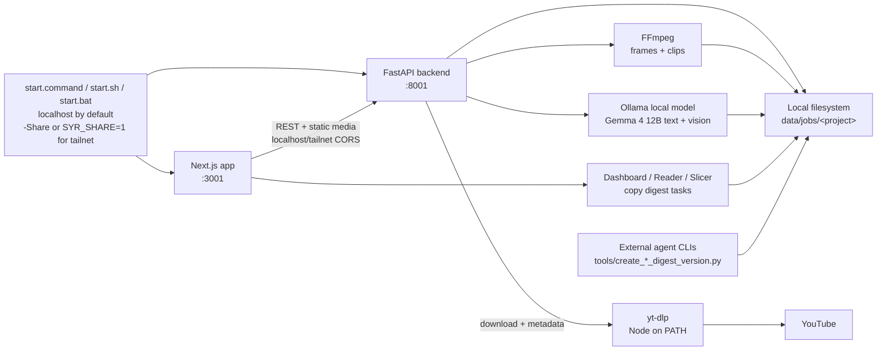

# Smart YouTube Reader

[](LICENSE) [](https://github.com/ehukaimedia/smart-youtube-reader/actions/workflows/ci.yml)

**Smart YouTube Reader** is an official Ehukai Media open-source project. It turns any YouTube URL into a structured, AI-readable archive — transcript, de-duplicated visual frames, and semantic chapters — that you or an AI agent can search, read, and learn from.

> **Why this exists:** Videos are great for watching, but terrible for referencing. This tool makes video content as accessible and searchable as a book.

---

## Proof: Demo AI Digest

The repository ships with bundled **Smart YouTube Reader Demo Digest** examples so the first dashboard already contains finished deliverables. They teach how to use the system and show the viral edge: structured context becomes a concise, visual, shareable learning artifact.

[Open the demo digest from the app](http://localhost:3001/reader/demo-smart-youtube-reader-digest) after running `./start.command`, or use the **Help** link in the top navigation. The demo reader includes a provider switcher for the **Claude Opus 4.8**, **Codex GPT 5.5**, and **Gemini 3.5 Flash High** versions.

No AI subscription is needed for the initial video digest. Capture, transcription, frame extraction, chaptering, and the first readable archive run locally through Ollama with regular `gemma4:12b`; the external-agent demos are optional examples for generating polished follow-up digest images. Gemma 4 reads the transcript through Ollama structured JSON output for chaptering and uses vision to rank candidate video frames for each chapter. When you want tighter visual evidence, the slicer lets you replace or refine the selected frames.



| Capture | Reader context |
|---|---|
|  |  |

| Group synthesis | Local/Tailscale sharing |
|---|---|
|  |  |

---

## Architecture & Design

### Local-First Design
Smart YouTube Reader is built on a **local-first** architecture.
* **No Database**: It uses the local filesystem for all storage. Jobs, transcripts, and frames are kept under the `data/` directory.
* **Privacy & Control**: All processing is performed on your machine.
* **No AI subscription for the initial digest**: The first structured video archive is generated locally; paid cloud AI tools are optional for later external-agent digest variants.
* **Backend**: A FastAPI (Python) server handles the orchestration, yt-dlp downloading, FFmpeg frame slicing, image de-duplication (using image hashes), and local Ollama model calls.
* **Frontend**: A Next.js (React) application provides a visual dashboard, an interactive reader with timestamp-linked transcript search, and a clip-slicer.

### System Flow



### Local AI Model Expectations
For semantic chaptering and vision-assisted frame selection, Smart YouTube Reader uses **Ollama** to run regular Gemma 4 locally.
* **Runtime Requirement**: Install Ollama and keep it running on Windows, macOS, or Linux.
* **Default Model**: The application defaults to `gemma4:12b`, the regular Ollama Gemma 4 12B model with text and image support.
* **First-run download**: The launch scripts check for `gemma4:12b` and run `ollama pull gemma4:12b` when it is missing. The model is about 7.6 GB, so the first launch can take several minutes.
* **Chaptering output**: Transcript chaptering requests Ollama JSON Schema output first, then falls back to prompt-only JSON/XML parsing, and finally creates transcript-grounded deterministic chapters if the model returns malformed structure.
* **Image selection**: The backend first narrows frame candidates with local frame metadata, then sends a small candidate set to Gemma 4 vision and accepts only returned filenames from that set. If the vision call fails or returns invalid JSON, the deterministic frame scorer is used as a fallback.
* **Audio**: Some Gemma 4 model metadata may report audio capability, but Smart YouTube Reader does not send raw audio to the model. The app extracts transcript text first.

### Why This Over yt-dlp + Whisper or Cloud Tools?

| Option | Best at | Smart YouTube Reader adds |
|---|---|---|
| `yt-dlp` + transcript tooling | Raw media, captions, and one-off extraction. | A durable archive folder with transcript, visual frames, semantic chapters, reader UI, slicer workflow, and agent-ready JSON. |
| Cloud video AI tools | Hosted summaries and fast collaboration. | Local-first storage and processing for the initial archive, no required AI subscription, and inspectable files you can keep, script, or hand to external agents. |
| Manual notes from a video | Human judgment and selective attention. | Timestamp-linked context, de-duplicated evidence frames, search, reusable digest workflows, and repeatable project exports. |

---

## What it produces

| File | What's inside |
|---|---|
| `transcript.json` | Full text with timestamps |
| `frames/` | De-duplicated screenshots at regular intervals |
| `archive.json` | AI-generated chapters, each with a summary and frame images |
| `manifest.json` | Job metadata (title, URL, chapter count) |

---

## Features

- **Semantic chapters** — AI reads the transcript and groups it into logical sections with titles and summaries
- **Visual matching** — Each chapter is paired with high-signal frames from the video using Gemma 4 vision plus local frame metadata
- **Local model** — Archive generation uses regular Gemma 4 through Ollama
- **YouTube timestamp links** — Every chapter and transcript line links directly to that moment in the video
- **Video Slicer** — Cut precise clips and manually select the frames that best match the chapter content
- **Large image inspection** — Click any Reader summary or chapter image to open a focused larger view with the original file link
- **Agent-ready** — The `archive.json` output is designed to be read by AI agents; image URLs are fully resolved
- **External-agent AI Digests** — Copy a CLI task for Codex or another LLM to create a shorter learning-focused digest without modifying the source project
- **AI Digest with Images** — Default digest workflow: Codex paired with GPT 5.5 image generation creates novel WebP teaching images after inspecting the archive text and real frame evidence; premium mode is full-color and concept-adaptive for inspired visual learning
- **Group AI Digests** — Combine multiple completed projects into a novel cross-video lesson with durable facts, theory, hypotheses, and generated WebP teaching images

---

## Prerequisites

To run Smart YouTube Reader locally, you need the following:

- **Ollama** — Required for local model generation (`ollama pull gemma4:12b`).
- **FFmpeg** — Used for frame extraction and video slicing. Install it with your platform package manager.
- **Python 3.11+** — The version CI verifies.
- **Node.js 20+** (pinned in [frontend/.nvmrc](frontend/.nvmrc)) — Required by **both** the frontend **and** the backend. `yt-dlp` invokes Node at download time to solve YouTube's challenge, so Node must be on the `PATH` the backend process inherits (the backend also searches `~/.nvm`, `~/.volta/bin`, and `/opt/homebrew/bin`).

> **Optional — private/age-restricted videos:** set `YDL_COOKIES_BROWSER=chrome` (or `firefox`) before launching so `yt-dlp` reads cookies from that browser. It is unset by default; cookies are sent only to YouTube via `yt-dlp`.

---

## Quick Start

### One-click launch (Mac)
```bash
./start.command
```
This starts both the backend and frontend. On first run it creates the backend virtualenv, installs Python and Node dependencies, and then launches — so the first launch takes a few minutes; later launches are fast. By default it binds to `localhost` only; set `SYR_SHARE=1 ./start.command` to also expose the app on your network/tailnet.

### Windows launch
```powershell
.\start.bat
```
Use `.\start.bat -Share` to bind to all interfaces and open the app on your Tailscale URL when Tailscale is connected. `.\start.ps1 -Share` is also supported.

### Manual setup

**1. Local model**
```bash
ollama pull gemma4:12b
```

Keep the Ollama app or `ollama serve` running while the backend is active.

**2. Backend**
```bash
cd backend
python3 -m venv .venv
source .venv/bin/activate
pip install -r requirements.txt -r requirements-dev.txt
uvicorn app.main:app --reload --port 8001
```

On Windows PowerShell, activate the backend environment with:
```powershell
.\.venv\Scripts\Activate.ps1
```

**3. Frontend**
```bash
cd frontend
npm install
npm run dev -- --port 3001
```

Then open `http://localhost:3001` in your browser. For the full contributor walkthrough (and code-style guidelines), see [CONTRIBUTING.md](CONTRIBUTING.md), the canonical setup reference.

---

## Verification & Testing

Backend unit tests (pytest) cover the digest prompt, archive parsing, Ollama runtime helpers, share-info, and slicer-security helpers, and the backend is linted with [ruff](https://docs.astral.sh/ruff/). The frontend is gated in CI by ESLint (`--max-warnings 0`) and a production build. The download → frame-extraction → de-duplication pipeline currently relies on manual testing; contributions that add coverage there are especially welcome.

### Backend Verification
Verify the backend with `ruff` and `pytest`:
```bash
cd backend
source .venv/bin/activate
ruff check .
python -m pytest
```

### Frontend Verification
Run frontend linting and build checks to ensure code quality:
```bash
cd frontend
# Run linter
npm run lint

# Build the Next.js production bundle
npm run build
```

---

## CLIs & Tooling

### AI Digest CLI
AI digest creation is handled by external agents through a local CLI. The app does not run a local digest model or deterministic fallback in the backend. In the Reader, `Copy AI Digest CLI Task` is the default image-rich WebP workflow for Codex or another capable LLM. The copied task lets the operator choose `simple` text-led infographics or `premium` full-color, concept-adaptive visual-learning infographics before generation. `Copy Text-Only AI Digest Task` remains available when you want to preserve source image references instead of generating new teaching images.

The recommended default workflow is Codex paired with GPT 5.5 image generation: Codex reads the archive text, inspects the source frame images as evidence, writes the digest draft, creates novel WebP teaching images, and then runs the materialization command. The CLI remains provider-agnostic; the requirement is that the agent actually inspect the project evidence before writing text or creating images.

```bash
python3 tools/create_ai_digest_version.py "data/jobs/<project-folder>"
```

The command above prints the default image-rich WebP digest task. For the explicit text-only fallback, add `--text-only`:

```bash
python3 tools/create_ai_digest_version.py "data/jobs/<project-folder>" --text-only
```

Both commands print the exact task for Codex or another agent. The agent writes a JSON draft, then materializes the digest project:

```bash
python3 tools/create_ai_digest_version.py "data/jobs/<project-folder>" --draft "data/jobs/<project-folder>/generated/ai-digest-draft.json"
```

The CLI creates a separate `kind: ai_digest` project under `data/jobs/`; the original project is not modified. Text-only AI digests preserve image references from kept source chapters so humans can curate images later. Default AI digests create one novel generated WebP teaching image per digest chapter, up to six images total, and reference only safe `generated/` paths in the derived project. Premium infographic mode requires GPT 5.5 image generation for the bitmap visual rather than local vector-only placeholders, but its creative structure is adaptive: the agent reverse-engineers the chapter concept and chooses the full-color composition that best improves understanding and recall.

Every digest task includes `preservation_items` extracted from the archive and transcript slices. Treat them as a checklist for names, metrics, benchmarks, examples, and claim direction so the digest is shorter without losing the facts that make the video useful.

### Group AI Digest CLI
Group digest creation combines two or more completed projects into one new learning project. From the Dashboard, select completed projects and use `Copy Group AI Digest CLI Task` to copy the external-agent workflow.

Unlike a single-video digest, a group digest is not a playlist export and does not preserve original frame paths. The agent reads every source `archive.json`, inspects frame images as evidence, and writes a novel combined transcript rather than concatenating source transcripts. Each chapter must teach digestible facts, theory, and a testable hypothesis, and the CLI rejects drafts that are too extractive from the source wording.

The materialized group project contains exactly three newly generated WebP teaching images. Codex GPT 5.5 image generation is the recommended pairing for this step because the images should be created from the new combined lesson plus the inspected visual evidence, not from prompt-only guesses.

```bash
python3 tools/create_group_ai_digest_version.py "data/jobs/<project-one>" "data/jobs/<project-two>" --title "Combined Learning Digest"
```

That prints the exact task for Codex or another agent. The agent writes the group draft and creates the three image files in the printed staging folder, then runs the materialization command printed by the CLI. The result is a separate `kind: group_ai_digest` project under `data/jobs/` with a `Group AI Digest` dashboard badge. The source projects stay untouched.

### Summary Thumbnail CLI
Create a project thumbnail from the archive text and attached frame images:

```bash
python3 tools/create_summary_thumbnail.py "data/jobs/<project-folder>"
```

You can also pass a job id:

```bash
python3 tools/create_summary_thumbnail.py "a24af63e-96e3-4ca5-9f59-5f04707889e4"
```

The tool writes `generated/summary.webp` inside the project and updates both `archive.json` and `manifest.json` with:

```json
"summary_image": "generated/summary.webp"
```

The dashboard uses that image as the project thumbnail.

---

## Sharing Projects

Smart YouTube Reader is local-first, so the app can run on either `localhost` or your Tailscale tailnet IP. The global **Local / Tailscale** toggle in the top navigation switches the current app session and copied project links to the selected origin. By default launchers bind to `localhost` only and open the local app; launch with `SYR_SHARE=1 ./start.command` on macOS/Linux or `.\start.bat -Share` on Windows to bind all interfaces so your tailnet IP is reachable. In share mode, the launcher opens the Tailscale URL when one is available. The active mode is derived from the host currently serving the app.

| Mode | When to use | Link format |
|---|---|---|
| **Local** *(default)* | Only opening the app yourself, or working from the same machine. | `http://localhost:3001/...` |
| **Tailscale** | Opening the dashboard and project links from another device on your tailnet (laptop, phone, another desktop). | `http://<your tailnet IP>:3001/...` (e.g. `http://100.x.y.z:3001/dashboard`) |

### Enabling Tailscale mode

The app never installs or starts Tailscale silently. To use Tailscale mode you need the [Tailscale](https://tailscale.com/download) client running and signed in:

```bash
brew install --cask tailscale   # or download from https://tailscale.com/download
tailscale up                    # sign in and join your tailnet
```

When you flip the global toggle to Tailscale, the app redirects to the Tailscale origin when available. If it is unavailable, the app keeps you on Local and reports the current state:

- **Smart Reader was started in Local mode** — Tailscale may be connected, but ports 3001 and 8001 are only listening on `localhost`; restart with `.\start.bat -Share` on Windows or `SYR_SHARE=1 ./start.command` on macOS.
- **Tailscale is not installed** — install the client (link or Homebrew command above), then run `tailscale up`.
- **No tailnet IP yet** — the CLI is installed but `tailscale up` has not produced a `100.64.0.0/10` address yet; sign in and try again.
- **Tailscale is not running** — start the Tailscale menu-bar app or run `tailscale up`.

### Overriding both modes

If you front the app with a reverse proxy or a custom domain, set the `PUBLIC_SHARE_ORIGIN` environment variable on the backend (e.g. `PUBLIC_SHARE_ORIGIN=https://reader.example.com`). The toggle is then hidden and every copied link uses that origin.

---

## Agent Integration

The `archive.json` produced by each job is designed to be consumed by AI agents. Each archive includes timestamped chapter text plus local frame references, so external LLMs can reason from both transcript and visual evidence.

Digest workflows turn that archive into new agent-readable projects:

- **Single-project AI Digest** — Compresses one source video into a dense learning version while preserving important names, metrics, examples, and either default WebP teaching images or text-only source image references.
- **AI Digest with Images** — Uses an external LLM plus image generation to create novel WebP teaching images under `generated/`; source frames are evidence, not output images.
- **Group AI Digest** — Synthesizes multiple projects into a new lesson with its own transcript, exactly three generated WebP teaching images, and a `Group AI Digest` badge.

See [`skills/smart-youtube-reader/SKILL.md`](./skills/smart-youtube-reader/SKILL.md) for the full agent skill definition.

The checked-in CLI skill ports under `.antigravitycli/skills/`, `.codex/skills/`, and `.claude/skills/` are intentional adapters so Antigravity, Codex, and Claude can load the same Smart YouTube Reader workflows; canonical shared skills remain under `skills/`.

---

## Community & Governance

We welcome contributions and value our community's safety and security. Please review the following guidelines before participating:

* **[Contributing Guidelines](CONTRIBUTING.md)**: Learn how to set up your environment, follow project standards, and submit pull requests.
* **[Code of Conduct](CODE_OF_CONDUCT.md)**: Our expectations for community behavior and reporting enforcement.
* **[Security Policy](SECURITY.md)**: Instructions on how to privately report security vulnerabilities.

---

## License

Smart YouTube Reader's Ehukai Media code is licensed under the MIT License. Bundled third-party skill and vendor material carries its own license terms, including Apache-2.0 skill content under `skills/` and `.antigravitycli/skills/impeccable/`, plus the vendored MIT `modern-screenshot` browser helper.

See [LICENSE](LICENSE) and [THIRD_PARTY_NOTICES.md](THIRD_PARTY_NOTICES.md) for details.
