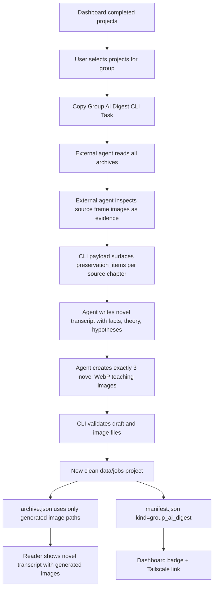

# Group AI Digest Flow

## Key Architecture Rule

Single-video text-only AI digests may preserve source frame references for human curation. Default single-video AI digests and group AI digests use generated WebP teaching images. Group source images are evidence only; the materialized group project contains only the three new generated WebP teaching images.
