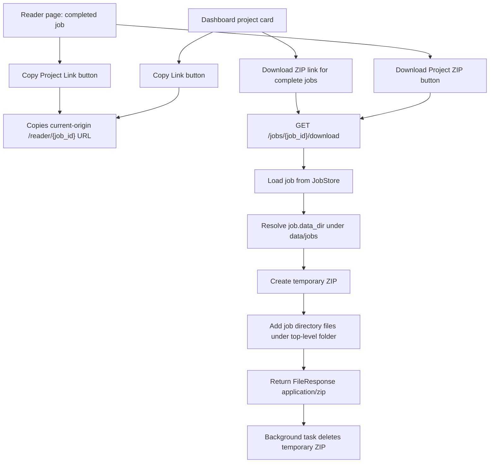

# Project ZIP Download Flow

```mermaid
flowchart TD
    A["Reader page: completed job"] --> B["Download Project ZIP button"]
    A --> J["Copy Project Link button"]
    K["Dashboard project card"] --> L["Copy Link button"]
    K --> M["Download ZIP link for complete jobs"]
    J --> N["Copies current-origin /reader/{job_id} URL"]
    L --> N
    M --> C
    B --> C["GET /jobs/{job_id}/download"]
    C --> D["Load job from JobStore"]
    D --> E["Resolve job.data_dir under data/jobs"]
    E --> F["Create temporary ZIP"]
    F --> G["Add job directory files under top-level folder"]
    G --> H["Return FileResponse application/zip"]
    H --> I["Background task deletes temporary ZIP"]
```
